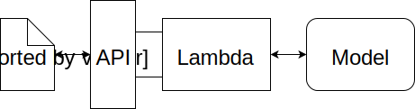

# Sentiment Analysis Web App using AWS SageMaker

This project predicts whether a user review is Positive or Negative using a deep learning LSTM model.

## Features
- NLP preprocessing using NLTK
- LSTM classifier built with PyTorch
- AWS SageMaker deployment
- Frontend web app for real-time predictions

## Tech Stack
Python, PyTorch, AWS SageMaker, HTML, JavaScript

## Files
- train.py → model training
- predict.py → inference logic
- model.py → LSTM model
- index.html → frontend UI
  
## Architecture

## Features
- AWS SageMaker deployment
- LSTM sentiment model
- Web interface for prediction
